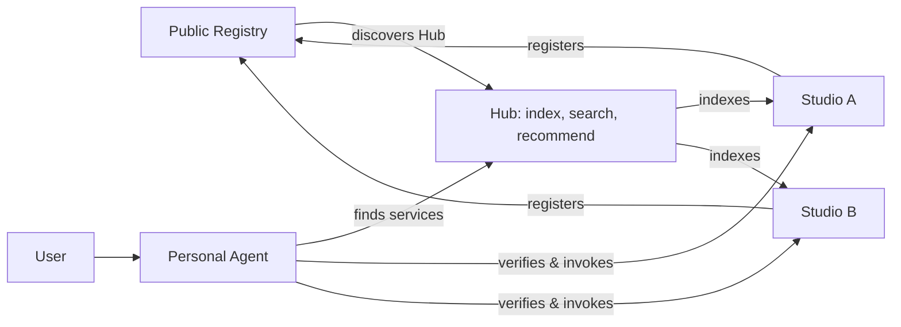

*Agent-Native Internet — when internet services become capability nodes that agents can discover and invoke*

The internet is undergoing a change deeper than any interface upgrade. In the past, people opened websites and apps, searched, browsed, and compared across platforms, then completed every operation themselves. The rise of AI agents makes another mode of connection a reality: users express a goal, a personal agent understands the intent, finds suitable services, and — with authorization — helps get the task done.

**The Agent-Native Internet** is a network form that treats agents as first-class participants of the internet. Applications not only present interfaces to humans; they also expose service capabilities that agents can discover, understand, invoke, and verify.

It is not about adding a chat box to an app, nor about rebuilding the internet on a blockchain. The real change is adding a new path — "the user delegates to an agent, and the agent connects directly to services" — alongside the old one of "the user enters a platform, then searches for services inside it." Platforms will not disappear overnight, but they no longer naturally own the starting point of every service interaction.

## 1. From a Page Internet to a Capability Internet

In the Web era, websites were the basic unit of publishing and connection; in the mobile era, apps became the main gateway to services. Both depend on people actively learning interfaces and workflows. Agents decouple user goals from software operation. Finding a photographer, planning a trip, or buying equipment is not fundamentally a need to open some app — it is a task of satisfying conditions, coordinating resources, and delivering a result.

With the user's permission, a personal agent can use preferences, time, budget, and context to turn fuzzy needs into explicit goals, then make requests to different services. The service side changes too. Beyond showcasing portfolios, a photographer can offer agent-readable shooting styles, prices, availability, and booking capabilities; beyond product detail pages, a merchant can offer structured product data, inventory, and transaction interfaces.

This does not require eliminating human interfaces. One application can have both a human-facing experience and an agent-facing capability interface. The former helps users understand and choose; the latter lets software collaborate directly. **The key to being agent-native is not that apps disappear, but that service capabilities can be used independently of app interfaces.**

## 2. Three Drivers Behind the Trend

The development of the agent-native internet comes from the convergence of three changes: user demand, software interfaces, and production costs.

First, users want results, not repeated learning of software operations. As agents become more reliable, people are motivated to hand querying, comparing, and repetitive processes to software, while retaining key decisions and authorization rights.

Second, applications are gaining machine-callable interfaces. Technologies such as model tool calling and MCP mean agents no longer have to simulate human clicks on web pages — they can request service capabilities directly. The more callable services exist, the more useful agents become; the more widely agents are used, the more incentive service providers have to open up their capabilities, creating a potential positive feedback loop.

Third, AI is lowering the cost of software development, testing, content production, and parts of operations. Individuals and small teams gain the opportunity to own independent digital services at lower cost. Security, customer support, and governance remain indispensable, but the organizational scale required to operate independently may shrink.

Early commercial signals have appeared. Adobe reported that in July 2025, generative-AI-driven traffic to U.S. retail sites grew roughly 4,700% year over year, though the channel's absolute volume remains below traditional major sources.[1] McKinsey estimates that by 2030, AI agents may participate in orchestrating $3–5 trillion of global consumer goods transactions.[2] These are projected transaction volumes — not agent platform revenue — and they do not directly prove that decentralized networks will replace existing platforms.

A more robust judgment, therefore, is: **opening service capabilities to agents is becoming an increasingly important product requirement.** Which form of network organization ultimately dominates still depends on experience, cost, trust, and regulation.

## 3. How an Open Service Network Forms

An agent being able to invoke a known service does not mean it can automatically find unknown services across the entire internet. A true agent-native internet needs to connect service registration, discovery, search, and invocation.

The photography industry illustrates this process intuitively. On traditional photography platforms, a photographer registers an account, uploads a portfolio and packages, and becomes a merchant record in the platform's database. Users must enter the platform to find him. In the agent-native model, a photographer can own an independent **Studio**: it is both a website showcasing the work and a service node that can respond to agent queries. GLOFTER is a product example of this model, not an investment or partnership proposal of this article.

Once a Studio is online, the network needs to know it exists. One feasible open-network approach is to use a public registry on a blockchain to record node identity, service type, access address, and necessary metadata locations. Studios and the Hubs that aggregate services can register their registration relationships and ownership via NFTs or similar on-chain credentials. Here the NFT is a **verifiable node credential**, not a digital collectible aimed at image speculation.

The blockchain does not need to store the photographs, real-time availability, or quotes. That business data remains managed by the Studio itself. The chain only holds the small amount of information needed to discover and verify nodes. **The chain is a public registry, not a business database.** NFT registration is an optional design of this network — not a requirement for all agent applications, and not a mandatory mechanism of ARC.

When the network has a large number of Studios, it is inefficient for agents to scan the registry one by one and visit each node. **Hubs** therefore take on discovery and aggregation: they read or subscribe to registration information, index the portfolios, styles, regions, packages, and reputations that Studios make public, and then provide search and recommendation to agents. A personal agent first discovers a suitable Hub; the Hub finds candidate Studios; the agent then contacts the service agents directly to verify availability, price, and terms.

The key of this structure is not eliminating aggregation, but changing the ownership of aggregation and services. **Studios own the services; Hubs own the indexes.** One Studio can be listed by multiple Hubs, and one agent can query multiple Hubs. Hubs compete on discovery efficiency, recommendation quality, and reputation services — without having to own all the photographers and their customer relationships.

Openness does not automatically equal trustworthiness. On-chain registration cannot guarantee service quality, and NFTs cannot stop fraudulent merchants. Node failures, spam registrations, fraud, fake reviews, and transaction disputes still require governance mechanisms. Only by combining broad connectivity with trustworthy execution can an open network form a sustainable ecosystem.

## 4. The Structural Challenge for Centralized Platforms

The strength of centralized platforms lies not merely in owning servers, but in organizing users, merchants, search, transactions, and trust within one system. Users enter the platform first to obtain services, so the platform controls the traffic gateway, search ranking, merchant relationships, and transaction rules. This "mandatory gateway" position is the foundation of many platform business models.

Personal agents are beginning to change this path. An agent can search across platforms and Hubs according to the user's goal, or even invoke independent nodes directly. Merchants can also maintain their own machine-accessible services and be discovered by multiple gateways at once. Platforms can still provide better search, recommendation, payment, risk control, fulfillment, and consumer protection — but this value must be continuously proven through service quality, rather than resting entirely on gateway control.

**The biggest risk for centralized platforms is not that apps disappear, but that they cease to be the mandatory route by which users reach services.**

Search is a direct example of this change. A personal agent forms a search intent by combining user-permitted context; a centralized platform's AI can split the intent into multiple queries, concurrently call content, product, geographic, and real-time search, then aggregate, compare, and return a handful of candidates. One user intent may correspond to many machine searches. Traditional search engines will not lose their role — they may even receive more machine calls; what changes is that the search box is no longer necessarily the user gateway, and search capability gradually takes on an infrastructure role serving agents.

This also affects commercial recommendation. When an agent presents only a few candidates to the user, paid results must be clearly labeled and must not disguise themselves as the choices most aligned with the user's interests. Platform competition may gradually shift from gateway lock-in toward discovery quality, trustworthy transactions, and task-completion capability.

This is not a simple win-or-lose between centralization and decentralization. Large platforms, with scaled supply, mature payments, brand trust, and data quality, may well deliver excellent experiences through their own agents. The real competition is between **the integration efficiency of closed systems and the connectivity of open networks** — and whether the two can be combined.

## 5. New Value Is Shifting Toward Infrastructure

The agent-native internet both challenges platform gateways and opens new opportunities for infrastructure. Search, identity, payments, trust, and cloud capabilities once encapsulated inside super-apps now have the chance to become network services commonly needed by large numbers of independent service nodes.

**Agent-native cloud** is the first category of opportunity. Even when independent merchants and small teams can create software with AI, they do not want to manage servers, storage, agent runtime environments, backups, and security themselves. Cloud services can bundle these capabilities into managed products, letting a professional service provider quickly own a website and a digital node callable by agents. AI lowers development cost; cloud lowers long-term operating cost; together they expand the supply of independent services.

**Service discovery infrastructure** is the second category. Traditional search finds web pages, content, and products; agent search must additionally judge which service node can complete the task under current conditions. Public registries provide node existence; Hubs provide indexing, recommendation, and reputation. The capabilities of search companies can thus extend into open service networks.

**Trust and transaction infrastructure** is the third category. When an agent and a service node — with no prior shared platform account relationship — transact, they need clarity on identity, authorization, payment limits, fulfillment, refunds, and dispute liability. Machine execution cannot bypass user confirmation. Payments, verifiable credentials, regulated settlement, and reputation mechanisms will all play more important roles. Cross-border scenarios can explore programmable payments and digital assets, but whether to use stablecoins or traditional payment rails should be decided by cost, regulation, and consumer protection.

Therefore, large internet companies are not limited to passive defense. **Upgrading capabilities that today serve only their own apps into infrastructure that the entire agent network is willing to call** may become the more important long-term opportunity.

## 6. Lessons from ARC

ArcBlock's ARC demonstrates one engineering form of agent-native applications: applications run as Blocklets, simultaneously presenting interfaces to humans and exposing callable capabilities to agents. According to the official documentation, Blocklets on ARC provide MCP endpoints and discovery documents, allowing external agents that know the application's host address to recognize its public capabilities and invoke them with proper authorization.[3]

Two kinds of discovery must be distinguished here. What the ARC documentation describes is mainly **recognizing a service's capabilities after its address is already known**; the on-chain Registry and Hubs proposed earlier are responsible for **discovering previously unknown nodes across the whole network**. The two can be combined, but one should not mistakenly assume that ARC already natively implements a complete NFT registration network.

The value of ARC lies in providing a technical reference: an application can both be operated by humans and serve as an agent-accessible service node. Platforms in China can fully borrow this architectural idea — adopting more centralized directories, identity, payments, and governance while keeping protocols open; international networks can further explore independent deployment, public registries, and multi-Hub interoperability.

**Degree of centralization does not equal degree of openness.** A company-operated platform remains internationally competitive if its protocols are open, data is portable, and services can be connected independently; a nominally decentralized network with closed interfaces and a weak ecosystem will struggle to form network effects.

## 7. Next-Generation Internet Competition Revolves Around Connectivity Rights

The Agent-Native Internet is neither a repackaging of Web3 nor a prophecy that all users will abandon apps. It represents a new kind of internet connectivity relationship: users can express goals through personal agents; services can be discovered and invoked as independent capabilities; Hubs provide discovery efficiency at scale; and trust and transaction infrastructure connects parties that once belonged to different platforms.

The maturation of this path still depends on reliability, service supply, interoperability, regulation, and commercial incentives. Personal agents must protect privacy, obtain authorization, and explain their decisions; service networks must handle fraud, node failures, and disputes. Without these conditions, no number of open nodes will automatically form a valuable internet.

But the strategic direction already deserves serious attention. **The core of future internet competition will gradually expand from "who owns the biggest app" to "who controls the agent gateway that users trust, who connects the richest and most reliable service network, and who provides irreplaceable infrastructure."**

The real change is not that the internet no longer needs platforms, but that platforms no longer naturally equal gateways. Once services become network nodes, connectivity rights begin to be redistributed. That is the most noteworthy long-term significance of the agent-native internet.

---

## References

[1] Adobe, *Generative AI-Powered Shopping Rises with Traffic to U.S. Retail Sites* (2025). https://business.adobe.com/blog/generative-ai-powered-shopping-rises-with-traffic-to-retail-sites

[2] McKinsey, *The agentic commerce opportunity: How AI agents are ushering in a new era for consumers and merchants* (2025). https://www.mckinsey.com/capabilities/quantumblack/our-insights/the-agentic-commerce-opportunity-how-ai-agents-are-ushering-in-a-new-era-for-consumers-and-merchants

[3] ArcBlock, *Agent Access — ARC Developer Documentation*. https://www.arcblock.io/zh/docs/agent-access/

*The NFT node registration, open Registry, and multi-Hub discovery described in this article are optional network architecture designs, not industry standards adopted by all agent products.*
