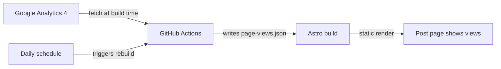

Many blogs run Google Analytics, but the GA dashboard is only visible to the site owner. If you want readers to see "this post has been read N times" right on the article page, things get less trivial: GA4's `gtag.js` **only sends data — it offers no browser-side API to read it back**.

This post describes an approach that fits static sites (Astro / GitHub Pages): **at build time**, use a service account to call the GA4 Data API, pull the view count for each article, and render it as static HTML; then use a scheduled GitHub Actions run to rebuild daily and keep the numbers fresh.

The end result: the article's meta line reads "5 min read · 2300 chars · **128 views**".

## Why You Can't Just Read GA Data from Frontend JS

Reading GA4 data requires the [GA4 Data API](https://developers.google.com/analytics/devguides/reporting/data/v1), which authenticates with a service account key. Putting that key in frontend code means publishing it — anyone could read all your analytics. So the key must live on a server or in CI. For a purely static site, **fetching at build time** is the most natural choice: free, secure, and zero extra infrastructure.

The overall data flow:



## Step 1: Enable the API and Create a Service Account

1. **Find your GA4 numeric Property ID**: Google Analytics → ⚙️ Admin → Property Settings. The "PROPERTY ID" at the top right is a plain number (not the `G-` prefixed Measurement ID).
2. **Enable the GA4 Data API**: in Google Cloud Console, search for "Google Analytics Data API" → Enable.
3. **Create a service account**: APIs & Services → Credentials → Create Credentials → Service Account; any name works. Then open it → Keys → Add Key → JSON, and download the key file.
4. **Grant read access**: back in GA → Admin → Property Access Management → add the service account's email with the **Viewer** role.

## Step 2: Configure GitHub Secrets

In your repo → Settings → Secrets and variables → Actions, add two secrets:

- `GA_PROPERTY_ID`: the numeric Property ID from step 1
- `GA_SERVICE_ACCOUNT_KEY`: the full contents of the downloaded JSON key file (paste the entire file as text)

## Step 3: Write the Fetch Script

Install the official client:

```bash
npm install @google-analytics/data
```

Create `scripts/fetch-page-views.mjs`:

```javascript
import { BetaAnalyticsDataClient } from '@google-analytics/data';
import fs from 'node:fs';
import path from 'node:path';

const OUT_FILE = path.resolve('src/data/page-views.json');
const propertyId = process.env.GA_PROPERTY_ID;
const keyJson = process.env.GA_SERVICE_ACCOUNT_KEY;

// Key design: skip gracefully without credentials,
// so local dev and forks keep working
if (!propertyId || !keyJson) {
	console.log('[page-views] No credentials configured, keeping existing data.');
	process.exit(0);
}

const client = new BetaAnalyticsDataClient({ credentials: JSON.parse(keyJson) });

// Pull all-time data, keep only article page paths
const [response] = await client.runReport({
	property: `properties/${propertyId}`,
	dateRanges: [{ startDate: '2020-01-01', endDate: 'today' }],
	dimensions: [{ name: 'pagePath' }],
	metrics: [{ name: 'screenPageViews' }],
	dimensionFilter: {
		filter: {
			fieldName: 'pagePath',
			stringFilter: { matchType: 'CONTAINS', value: '/blog/' },
		},
	},
	limit: 10000,
});

const views = {};
for (const row of response.rows ?? []) {
	// Strip trailing slashes so /blog/foo/ and /blog/foo are merged
	const pagePath = row.dimensionValues?.[0]?.value?.replace(/\/+$/, '') ?? '';
	const count = Number(row.metricValues?.[0]?.value ?? 0);
	if (!pagePath || !count) continue;
	views[pagePath] = (views[pagePath] ?? 0) + count;
}

fs.mkdirSync(path.dirname(OUT_FILE), { recursive: true });
fs.writeFileSync(OUT_FILE, JSON.stringify(views, null, 2) + '\n');
console.log(`[page-views] Wrote view counts for ${Object.keys(views).length} pages`);
```

Also create an empty initial data file `src/data/page-views.json` (just `{}`), so builds without credentials still work.

## Step 4: Display the Count on the Page

Write a small helper, `src/utils/pageViews.ts`:

```typescript
import pageViews from '../data/page-views.json';

const views: Record<string, number> = pageViews;

/** Total views for a post; undefined when no data exists */
export function getPageViews(lang: string, slug: string): number | undefined {
	return views[`/${lang}/blog/${slug}`];
}
```

Then add it to the meta line of your post layout (`BlogPost.astro`):

```astro
---
import { getPageViews } from '../utils/pageViews';
const views = slug ? getPageViews(lang, slug) : undefined;
---

<span>{minutes} min read</span>
<span class="sep">·</span>
<span>{wordCount} chars</span>
{views !== undefined && (
	<>
		<span class="sep">·</span>
		<span>{views} views</span>
	</>
)}
```

Note the `views !== undefined` check: a freshly published post has no data yet, and **hiding the whole segment** is a better experience than showing "0 views".

## Step 5: Wire It into the Build and Schedule Refreshes

Prepend the fetch script to your build command (`package.json`):

```json
{
	"scripts": {
		"build": "node scripts/fetch-page-views.mjs && astro build"
	}
}
```

Inject the secrets in your deploy workflow (`.github/workflows/deploy.yml`) and add a daily schedule:

```yaml
on:
  push:
    branches: [main]
  workflow_dispatch:
  # Rebuild daily to refresh the view counts
  schedule:
    - cron: '17 0 * * *' # UTC 00:17

jobs:
  build:
    steps:
      - uses: actions/checkout@v7
      - uses: withastro/action@v6
        env:
          GA_PROPERTY_ID: ${{ secrets.GA_PROPERTY_ID }}
          GA_SERVICE_ACCOUNT_KEY: ${{ secrets.GA_SERVICE_ACCOUNT_KEY }}
```

Once configured, run the workflow manually; `[page-views] Wrote view counts for N pages` in the build log means everything is wired up.

## Common Pitfalls

- **Property ID ≠ Measurement ID**. `G-XXXXXXX` is the Measurement ID; the Data API needs the plain numeric Property ID. Using the wrong one returns `NOT_FOUND`.
- **The service account must be added as a Viewer in GA**, otherwise you get `PERMISSION_DENIED` — the most common failure.
- **GA data has latency**. The last 24–48 hours may be incomplete, so a once-a-morning rebuild is plenty; more frequent runs buy you nothing.
- **The numbers are build snapshots, not real-time**. That's the inherent trade-off of the static-site approach: you exchange freshness for zero servers. If you truly need real-time counts, you need a serverless proxy layer — a significant jump in complexity.
- **Normalize trailing slashes**. GA records `/blog/foo/` and `/blog/foo` as separate rows; merge them when aggregating.

## Wrapping Up

The whole approach boils down to one idea: **move "reading data that requires a secret" from runtime to build time**. The GA4 Data API free quota is more than enough for a personal blog, and GitHub Actions scheduled runs are free. What the reader sees is a purely static number — no loading flicker, no third-party dependency, and no exposed credentials.

This is the exact implementation running on this blog; the full code is in the [GitHub repository](https://github.com/shenxiuqiang/shenxiuqiang.github.io).
