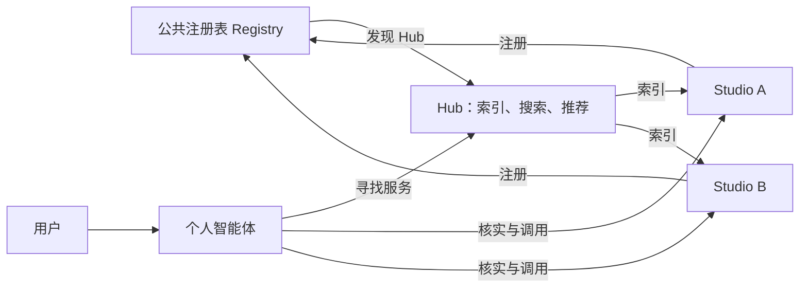

*Agent-Native Internet — 当互联网服务成为智能体可发现、可调用的能力节点*

互联网正在经历一次比界面升级更深刻的变化。过去，人们打开网站和 App，在不同平台之间搜索、浏览、比较，再亲自完成操作。AI 智能体（Agent）的出现，使另一种连接方式开始成为现实：用户表达目标，个人智能体理解意图，寻找合适的服务，在获得授权后协助完成任务。

**智能体原生互联网（Agent-Native Internet）**，是将智能体视为互联网一等参与者的网络形态。应用不仅向人提供界面，也向智能体提供可以被发现、理解、调用和验证的服务能力。

它不是给 App 增加一个聊天框，也不是简单地用区块链重做互联网。真正的变化，是从“用户进入平台，再在平台里寻找服务”，增加一条“用户委托智能体，智能体直接连接服务”的路径。平台不会突然消失，但不再天然拥有每一次服务交互的起点。

## 一、从页面互联网走向能力互联网

Web 时代，网站是信息发布与连接的基本单元；移动互联网时代，App 成为获取服务的主要入口。两者都依赖人主动学习界面和操作流程。智能体则把用户目标与软件操作分离开来。寻找摄影师、安排旅行或购买设备，本质上不是打开某个 App 的需求，而是满足条件、协调资源并取得结果的任务。

个人智能体可以在用户许可下利用偏好、时间、预算和上下文，把模糊需求整理成明确目标，再向不同服务提出请求。服务端也会改变。摄影师除了展示作品，还能提供可被智能体读取的拍摄风格、价格、档期与预约能力；商家除了商品详情页，还能提供结构化商品信息、库存和交易接口。

这不要求取消人类界面。一个应用可以同时拥有面向人的体验和面向智能体的能力接口。前者帮助用户理解和选择，后者让软件之间直接协作。**Agent-Native 的关键不是 App 消失，而是服务能力能够独立于 App 界面被使用。**

## 二、趋势形成的三个驱动力

智能体原生互联网的发展，来自用户需求、软件接口和生产成本三种变化的汇合。

首先，用户需要的是结果，而不是反复学习软件操作。随着智能体的可靠性提高，人们有动力把查询、比较和重复性流程交给软件，同时保留关键决策与授权权利。

其次，应用正在获得机器可调用的接口。模型工具调用、MCP 等技术，使智能体不必总是模拟人在网页上的点击，而可以直接请求服务能力。可调用服务越多，智能体越有用；智能体使用越广泛，服务提供者越有动力开放能力，由此形成潜在的正反馈。

第三，AI 正在降低软件开发、测试、内容生产和部分运营的成本。个人与小团队有机会用更低成本拥有独立数字服务。安全、客户支持和治理仍然不可或缺，但独立经营所需的组织规模可能缩小。

早期商业信号已经出现。Adobe 报告，2025 年 7 月生成式 AI 导向美国零售网站的流量同比增长约 4,700%，不过该渠道的绝对规模仍低于传统主要来源。[1] McKinsey 估计，到 2030 年，AI 智能体可能参与编排全球 3 万亿至 5 万亿美元的消费商品交易。[2] 这属于预测的交易规模，并不是智能体平台收入，更不能直接证明去中心化网络将取代现有平台。

因此，更稳健的判断是：**互联网服务面向智能体开放能力，正成为越来越重要的产品要求。** 最终由哪种网络组织方式主导，仍取决于体验、成本、信任与监管。

## 三、开放服务网络如何形成

智能体能够调用一个已知服务，并不意味着能够在整个互联网上自动找到未知服务。真正的智能体原生互联网，需要把服务登记、发现、搜索和调用连接起来。

摄影行业可以直观解释这一过程。传统摄影平台中，摄影师注册账号、上传作品和套餐，成为平台数据库中的商家记录。用户必须先进入平台才能找到他。智能体原生模式下，摄影师可以拥有独立的 **Studio**：它既是展示作品的网站，也是能够响应智能体查询的服务节点。GLOFTER 是这一模式的产品案例，而非本文的投资或合作提案。

Studio 上线后，需要让网络知道它存在。一种可行的开放网络方案，是使用区块链上的公共注册表（Registry）登记节点身份、服务类型、访问地址和必要的元数据位置。Studio 和负责聚合服务的 Hub，可以通过 NFT 或类似链上凭证登记注册关系和所有权。这里的 NFT 是**可验证的节点凭证**，而不是以图片收藏为目的的数字藏品。

区块链不需要存储摄影作品、实时档期和报价。这些业务数据仍由 Studio 自己管理。链上只保存发现和验证节点所需的少量信息。**链是公共注册表，不是业务数据库。** NFT 注册是这一网络的可选设计，不是所有 Agent 应用的必要条件，也不是 ARC 的强制机制。

当网络拥有大量 Studio，智能体逐个查询注册表并访问节点并不高效。**Hub** 因而承担发现与聚合：它读取或订阅注册信息，索引 Studio 公开的作品、风格、地域、套餐和信誉，再向智能体提供搜索与推荐。个人智能体先发现合适的 Hub，再由 Hub 找到候选 Studio，随后直接联系服务智能体核实档期、价格和条件。

这套结构的关键不是取消聚合，而是改变聚合与服务的所有权。**Studio 拥有服务，Hub 拥有索引。** 一个 Studio 可以被多个 Hub 收录，一个智能体也可以查询多个 Hub。Hub 依靠发现效率、推荐质量和信誉服务竞争，而不必拥有全部摄影师及其客户关系。

开放并不自动等于可信。链上注册无法保证服务质量，NFT 也不能阻止虚假商家。节点失效、垃圾注册、欺诈、评价造假和交易纠纷仍需要治理机制。开放网络只有把广泛连接与可信执行结合起来，才能真正形成可持续的生态。

## 四、中心化平台的结构性挑战

中心化平台的强大，不只因为它拥有服务器，更因为它把用户、商家、搜索、交易和信任组织在同一体系。用户为了获得服务先进入平台，平台因此掌握流量入口、搜索排序、商家关系和交易规则。这种“必经入口”地位，是许多平台商业模式的基础。

个人智能体开始改变这条路径。它可以根据用户目标跨平台、跨 Hub 寻找服务，甚至直接调用独立节点。商家也可以维护自己的机器可访问服务，并同时被多个入口发现。平台仍可提供更好的搜索、推荐、支付、风控、履约和消费者保护，但这些价值需要通过服务质量继续证明，而不再完全依赖入口控制。

**中心化平台最大的风险，不是 App 消失，而是不再成为用户抵达服务的必经之路。**

搜索是这一变化的直接例子。个人智能体结合用户许可的上下文形成搜索意图；中心化平台的 AI 可以把意图拆成多个查询，并发调用内容、商品、地理和实时搜索，再汇总比较，返回少量候选。一次用户意图可能对应多次机器搜索。传统搜索引擎不会因此失去作用，甚至可能获得更多机器调用；变化的是搜索框不再必然是用户入口，搜索能力逐步增加面向智能体的基础设施角色。

这也影响商业推荐。智能体只给用户少数候选时，付费结果需要明确标识，不能伪装成最符合用户利益的选择。平台竞争可能从锁定入口，逐步转向发现质量、可信交易和任务完成能力。

这不是中心化与去中心化的简单胜负。大型平台拥有规模化供给、成熟支付、品牌信任和数据质量，完全可能通过自己的智能体提供优秀体验。真正的竞争，是**封闭体系的整合效率与开放网络的连接能力**，以及两者能否结合。

## 五、新的价值正在向基础设施转移

智能体原生互联网既挑战平台入口，也为基础设施打开新机会。过去封装在超级 App 内部的搜索、身份、支付、信任和云能力，有机会成为大量独立服务节点共同需要的网络服务。

**智能体原生云**是第一类机会。独立商家和小团队即使能够借助 AI 创建软件，也不愿自行管理服务器、存储、Agent 运行环境、备份与安全。云服务可以把这些能力组合成托管产品，让一个专业服务者快速拥有网站和可被智能体调用的数字节点。AI 降低开发成本，云降低长期运行成本，两者共同扩大独立服务供给。

**服务发现基础设施**是第二类机会。传统搜索寻找网页、内容和商品，智能体搜索还需要判断哪个服务节点在当前条件下能够完成任务。公共注册表提供节点存在性，Hub 提供索引、推荐和信誉。搜索企业的能力因此可以扩展到开放服务网络。

**信任与交易基础设施**是第三类机会。两个此前没有共同平台账户关系的智能体与服务节点进行交易，需要明确身份、授权、支付额度、履约、退款和争议责任。机器执行不能绕过用户确认。支付、可验证凭证、受监管结算和信誉机制都会承担更重要的角色。跨境场景可以探索可编程支付和数字资产，但是否采用稳定币或传统支付轨道，应由成本、监管和消费者保护决定。

因此，大型互联网公司并非只能被动防御。**把今天只服务自身 App 的能力升级为整个 Agent 网络愿意调用的基础设施**，可能成为更重要的长期机会。

## 六、ARC 的现实启示

ArcBlock 的 ARC 展示了智能体原生应用的一种工程形态：应用以 Blocklet 运行，同时向人提供界面、向智能体暴露可调用能力。根据官方文档，ARC 上的 Blocklet 提供 MCP 端点和发现文档，使知道应用主机地址的外部智能体能够识别其公开能力，并在适当授权后调用。[3]

这里需要区分两种发现。ARC 文档描述的主要是**已知服务地址后识别其能力**；前文提出的链上 Registry 和 Hub 负责的是**在整个网络中发现原本未知的节点**。两者能够组合，但不能误认为 ARC 已经原生实现了完整的 NFT 注册网络。

ARC 的价值在于提供了技术参照：一个应用既可以供人操作，也可以作为智能体可访问的服务节点。国内平台完全可以借鉴这一架构思想，采用更集中化的目录、身份、支付和治理，同时保持协议开放；国际网络则可以进一步探索独立部署、公共注册和多 Hub 互通。

**中心化程度不等于开放程度。** 企业运营的平台如果协议开放、数据可迁移、服务可独立接入，仍有国际竞争力；名义上去中心化的网络如果接口封闭、生态薄弱，也难以形成网络效应。

## 七、下一代互联网的竞争围绕连接权展开

Agent-Native Internet 不是 Web3 的重新包装，也不是所有用户都将放弃 App 的预言。它代表一种新的互联网连接关系：用户可以通过个人智能体表达目标，服务可以作为独立能力被发现和调用，Hub 提供规模化发现效率，信任与交易基础设施连接原本属于不同平台的主体。

这条路线的成熟仍取决于可靠性、服务供给、互操作性、监管和商业激励。个人智能体必须保护隐私、获得授权并解释决策；服务网络必须处理欺诈、节点失效和纠纷。没有这些条件，开放节点数量再多，也不会自动形成有价值的互联网。

但战略方向已经值得认真对待。**未来互联网竞争的核心，将从“谁拥有最大的 App”，逐步扩展为“谁掌握用户信任的智能体入口、谁连接最丰富可靠的服务网络，以及谁提供不可替代的基础设施”。**

真正的变化不是互联网不再需要平台，而是平台不再天然等于入口。服务成为网络节点之后，连接权开始重新分配。这正是智能体原生互联网最值得关注的长期意义。

---

## 参考资料

[1] Adobe, *Generative AI-Powered Shopping Rises with Traffic to U.S. Retail Sites* (2025). https://business.adobe.com/blog/generative-ai-powered-shopping-rises-with-traffic-to-retail-sites

[2] McKinsey, *The agentic commerce opportunity: How AI agents are ushering in a new era for consumers and merchants* (2025). https://www.mckinsey.com/capabilities/quantumblack/our-insights/the-agentic-commerce-opportunity-how-ai-agents-are-ushering-in-a-new-era-for-consumers-and-merchants

[3] ArcBlock, *Agent Access — ARC Developer Documentation*. https://www.arcblock.io/zh/docs/agent-access/

*本文中的 NFT 节点注册、开放 Registry 与多 Hub 发现是可选的网络架构设计，并非已被所有 Agent 产品采用的行业标准。*
