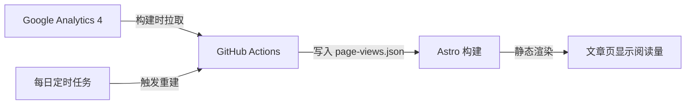

很多博客都接了 Google Analytics，但 GA 的面板只有站长自己能看。如果想让读者在文章页直接看到「本文被阅读了多少次」，事情就没那么简单了：GA4 的 `gtag.js` **只负责上报数据，不提供任何浏览器端的读取接口**。

本文介绍一种适合静态站点（Astro / GitHub Pages）的方案：**构建时**用 Service Account 调 GA4 Data API，把每篇文章的访问量拉下来，直接渲染成静态 HTML；再用 GitHub Actions 每天定时重建一次，让数字保持新鲜。

最终效果：文章页顶部元信息栏显示「约 5 分钟 · 2300 字 · **128 次阅读**」。

## 为什么不能用前端 JS 直接读 GA 数据

读取 GA4 数据必须调用 [GA4 Data API](https://developers.google.com/analytics/devguides/reporting/data/v1)，而它需要 Service Account 密钥做认证。密钥一旦写进前端代码就等于公开，任何人都能拿它读你的全部统计数据。所以密钥只能待在服务端或 CI 里——对纯静态站点来说，**构建时拉取**是最自然的选择：免费、安全、不引入任何额外服务。

整体数据流：



## 第一步：启用 API 并创建 Service Account

1. **找到 GA4 数字媒体资源 ID**：Google Analytics → ⚙️ 管理 → 媒体资源设置，右上方「媒体资源 ID」是一串纯数字（注意不是 `G-` 开头的测量 ID）。
2. **启用 GA4 Data API**：Google Cloud 控制台搜索 "Google Analytics Data API" → 启用。
3. **创建 Service Account**：API 和服务 → 凭据 → 创建凭据 → 服务账号，名称随意；创建后进入详情 → 密钥 → 添加密钥 → JSON，下载密钥文件。
4. **授权读取**：回到 GA → 管理 → 媒体资源访问权限管理 → 添加服务账号邮箱，角色选「查看者」即可。

## 第二步：配置 GitHub Secrets

仓库 → Settings → Secrets and variables → Actions，添加两条：

- `GA_PROPERTY_ID`：第一步的数字媒体资源 ID
- `GA_SERVICE_ACCOUNT_KEY`：下载的 JSON 密钥文件的完整内容（整个文件文本粘贴进去）

## 第三步：编写数据拉取脚本

安装官方客户端：

```bash
npm install @google-analytics/data
```

新建 `scripts/fetch-page-views.mjs`：

```javascript
import { BetaAnalyticsDataClient } from '@google-analytics/data';
import fs from 'node:fs';
import path from 'node:path';

const OUT_FILE = path.resolve('src/data/page-views.json');
const propertyId = process.env.GA_PROPERTY_ID;
const keyJson = process.env.GA_SERVICE_ACCOUNT_KEY;

// 关键设计：没有密钥时优雅跳过，本地开发和 fork 不受影响
if (!propertyId || !keyJson) {
	console.log('[page-views] 未配置密钥，跳过拉取，沿用现有数据。');
	process.exit(0);
}

const client = new BetaAnalyticsDataClient({ credentials: JSON.parse(keyJson) });

// 拉全量历史数据，只保留文章页路径
const [response] = await client.runReport({
	property: `properties/${propertyId}`,
	dateRanges: [{ startDate: '2020-01-01', endDate: 'today' }],
	dimensions: [{ name: 'pagePath' }],
	metrics: [{ name: 'screenPageViews' }],
	dimensionFilter: {
		filter: {
			fieldName: 'pagePath',
			stringFilter: { matchType: 'CONTAINS', value: '/blog/' },
		},
	},
	limit: 10000,
});

const views = {};
for (const row of response.rows ?? []) {
	// 去掉尾部斜杠，把 /zh/blog/foo/ 和 /zh/blog/foo 合并计数
	const pagePath = row.dimensionValues?.[0]?.value?.replace(/\/+$/, '') ?? '';
	const count = Number(row.metricValues?.[0]?.value ?? 0);
	if (!pagePath || !count) continue;
	views[pagePath] = (views[pagePath] ?? 0) + count;
}

fs.mkdirSync(path.dirname(OUT_FILE), { recursive: true });
fs.writeFileSync(OUT_FILE, JSON.stringify(views, null, 2) + '\n');
console.log(`[page-views] 已写入 ${Object.keys(views).length} 个页面的访问量`);
```

再建一个空的初始数据文件 `src/data/page-views.json`（内容就是 `{}`），保证没有密钥时也能正常构建。

## 第四步：在页面上显示

写一个读取工具 `src/utils/pageViews.ts`：

```typescript
import pageViews from '../data/page-views.json';

const views: Record<string, number> = pageViews;

/** 取某篇文章的累计访问量；没有数据时返回 undefined */
export function getPageViews(lang: string, slug: string): number | undefined {
	return views[`/${lang}/blog/${slug}`];
}
```

在文章页布局（`BlogPost.astro`）的元信息栏加上：

```astro
---
import { getPageViews } from '../utils/pageViews';
const views = slug ? getPageViews(lang, slug) : undefined;
---

<span>{minutes} 分钟</span>
<span class="sep">·</span>
<span>{wordCount} 字</span>
{views !== undefined && (
	<>
		<span class="sep">·</span>
		<span>{views} 次阅读</span>
	</>
)}
```

注意 `views !== undefined` 这个判断：刚发布的新文章还没有访问数据，此时**整块隐藏**比显示「0 次阅读」体验更好。

## 第五步：接入构建与定时刷新

把拉取脚本挂到构建命令前面（`package.json`）：

```json
{
	"scripts": {
		"build": "node scripts/fetch-page-views.mjs && astro build"
	}
}
```

在部署工作流（`.github/workflows/deploy.yml`）中注入密钥，并加一条每日定时触发：

```yaml
on:
  push:
    branches: [main]
  workflow_dispatch:
  # 每天定时重建一次，刷新访问量数字
  schedule:
    - cron: '17 0 * * *' # UTC 00:17 ≈ 北京时间 08:17

jobs:
  build:
    steps:
      - uses: actions/checkout@v7
      - uses: withastro/action@v6
        env:
          GA_PROPERTY_ID: ${{ secrets.GA_PROPERTY_ID }}
          GA_SERVICE_ACCOUNT_KEY: ${{ secrets.GA_SERVICE_ACCOUNT_KEY }}
```

配好后手动跑一次 workflow，日志里出现 `[page-views] 已写入 N 个页面的访问量` 就说明打通了。

## 几个容易踩的坑

- **Property ID ≠ Measurement ID**。`G-XXXXXXX` 是测量 ID，Data API 要的是纯数字的 Property ID，填错会报 `NOT_FOUND`。
- **Service Account 必须在 GA 里加为「查看者」**，否则报 `PERMISSION_DENIED`，这是最常见的问题。
- **GA 数据有延迟**。最近 24–48 小时的数据可能不完整，所以定时任务放在每天早上跑一次即可，没必要更频繁。
- **数字是构建快照，不是实时的**。这是静态站方案的固有取舍：用部署频率换取零服务器。如果确实需要实时数字，就得加一个 Serverless 中转层，复杂度会上一个台阶。
- **尾斜杠要归一**。GA 会把 `/blog/foo/` 和 `/blog/foo` 记成两条记录，汇总时记得合并。

## 小结

整个方案的核心思路就一句话：**把「读取需要密钥的数据」这件事从运行时挪到构建时**。GA4 Data API 免费额度对个人博客绰绰有余，GitHub Actions 的定时任务也免费，最终读者看到的是一个纯静态的数字——没有加载闪烁，没有第三方依赖，也没有暴露任何密钥。

本文介绍的就是本博客正在使用的实现，完整代码见 [GitHub 仓库](https://github.com/shenxiuqiang/shenxiuqiang.github.io)。
